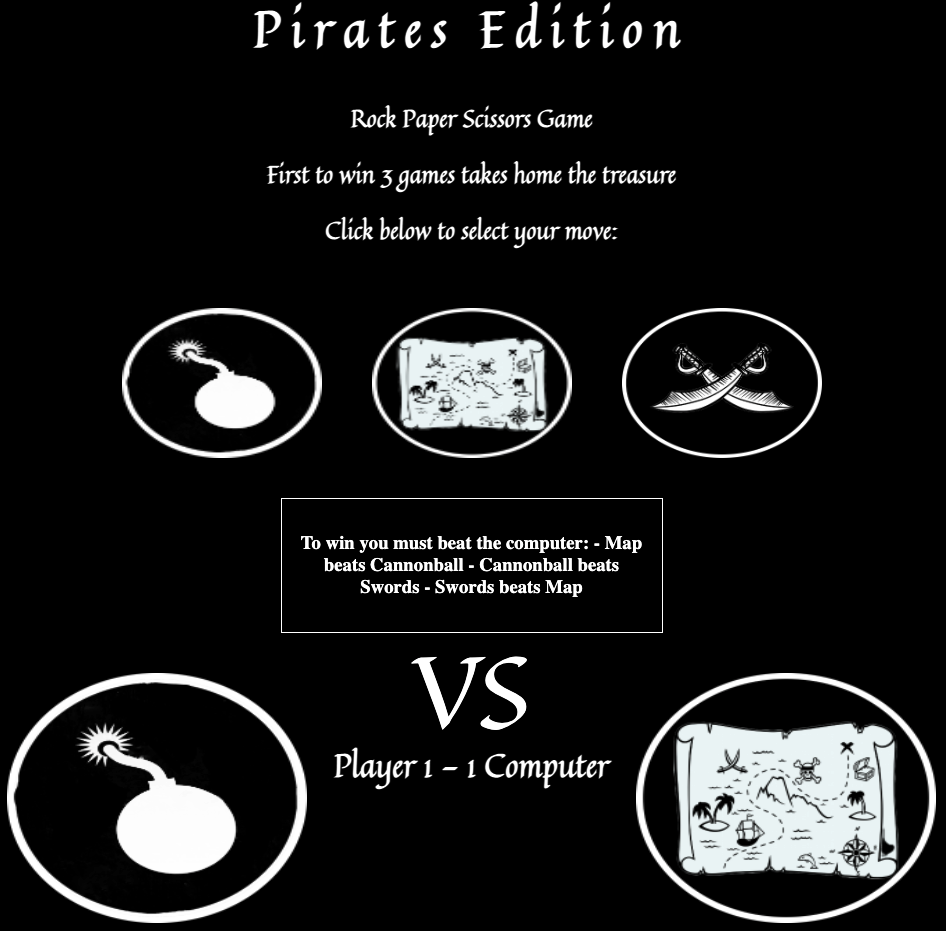
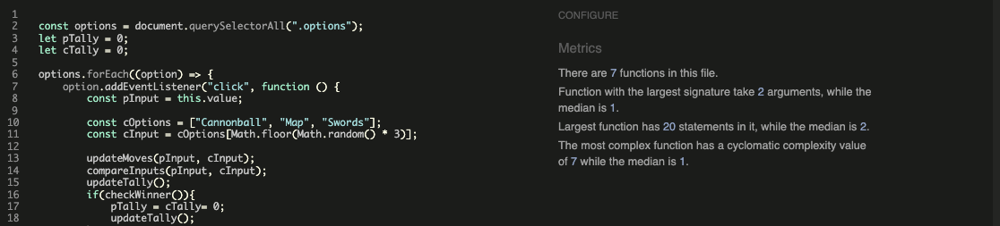
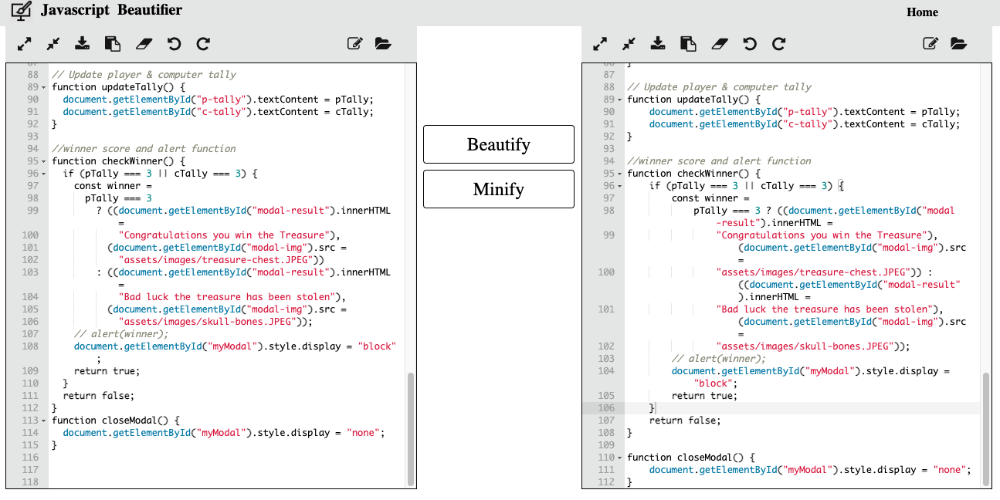

# project-2

# Pirates Edition ~ Rock Paper Scissor 
## Cannonball - Map - Swords

The live link can be found here - https://mrfogg866.github.io/project-2/ 

Rock Paper Scissors Pirates Edition is an extension of the classic game of chance, Rock Paper Scissors, created by Sam Kass and Karen Bryla. This variant was created by myself in 2022

This game is created to have fun playing against the computer. The game is entirely based on chance and the website is easy to navigate in order to easily find the rules.

## Features: 

- This Game features 3 buttons where the user will select one option, and play against the computer.
- If the user wins against the computer a popup will show signalling the win.
- If the user loses against the computer a popup will show signalling the loss.
- The first player to win 3 round is champion and takes home the treasure.

## User Goals:

#### First Time Visitor Goals:

- As  a first time visitor i want to play a game, and be able to easily understand the rules.
- As a first time user i want to be visually intrigued.
- As a first time user, if the game is quick and simple i am likely to play for longer.

#### Returning Visitor Goals:

- As a returning visitor, i am returning because i enjoy the simplicity of the game.
- As a returning visitor, i am returning because i enjoy the pirate theme of the game and i want to win the gold.

#### User Expectations:

- The layout should be easy to navigate.
- The rules of the game should be clear.
- These content should be displayd clear and legible.

## Testing 

- Each pages responsiveness is tested visually and by using chrome development tools & lighthouse the 3 pages results are shown below

I have tested my site on multiple devices. These include:

the aim is to allow the website to resize itself and fit to any device as small as a iphone se (375 x 667) upto a nest hub max (1280 x 800) to allow for a great user experience.

Validator Testing:

1. HTML
- No errors were returned when passing through the official W3C validator

2. CSS
- No errors were found when passing through the official (Jigsaw) validator

3. Javascript
- No warnings from wwww.jshint.com

4. Javascript Beautifier used here

## Technologies Used

- [HTML5](https://en.wikipedia.org/wiki/HTML5) (markup language) was used for structuring and presenting content of the website.

- [CSS3](https://en.wikipedia.org/wiki/CSS) (Cascading Style Sheets) was used to provide the style to the content written in a HTML.

- [Google Fonts](https://fonts.google.com/) was used to import font-family "Lato" and "Oswald" into style,css file and which was used throughout the pages of the website.

- [Font Awesome](https://fontawesome.com/) was used to import icons to the sites.

- [Chrome developer tools](https://www.google.com/intl/en_uk/chrome/) was used to debug and test the source code using HTML5 as well as to test site responsiveness.

-  [Github](https://github.com/) was used to create the repository and to store the project's code after pushed from Git.

- [Gitpod](https://www.gitpod.io/) was used as the Code Editor for the site.

- [W3C Markup  ](https://validator.w3.org/) tools were used to validate the HTML code used in the proejct.

- [Jigsaw](https://jigsaw.w3.org/) tools were used to validate the CSS  code used to style the proejct.

-  [Ami](http://ami.responsivedesign.is/) was used to develop a Mockup screenshot generator.

- [Picsart](https://picsart.com/) was used to edit the games images 

## Deployment:

1. The site was deployed to GitHub pages. The steps to deploy are as follows:
- In the GitHub repository, navigate to the Settings tab
- From the source section drop-down menu, select the Master Branch
- Once the master branch has been selected, the page will be automatically refreshed with a detailed ribbon display to indicate the successful deployment.

The live link can be found here - https://mrfogg866.github.io/project-2/ 

## Credit:

### Code

- The code structure was referenced from https://github.com/nsebhastian/rock-paper-scissors-game/blob/master/index.html
- The  pirate icons used on the head of the  page came from Font Awesome.
- Thanks to my mentor Marcel Mulders for his constructive feedback.

### Content

- The images used for the game were taken from google images and edited using the picsart app.